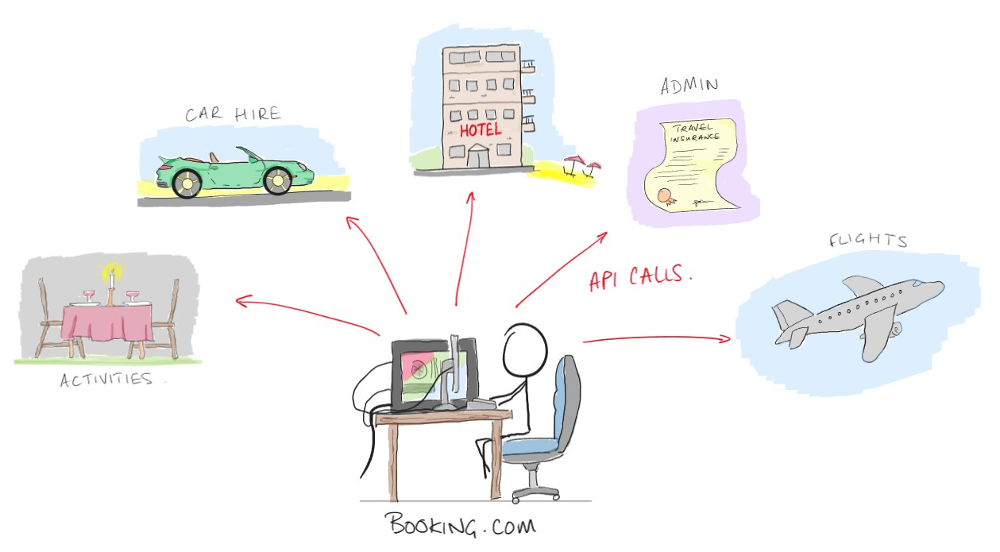

# Introduction to APIs

APIs (application programming interface) are a method of enabling different computer systems to talk to each other; commonly we use them to connect complex back-end systems, with user-friendly front-end interfaces.

## Some Analogies

There are some common analogies used to help people understand APIs:

- You go to a restaurant for a meal; you're the end user reading the menu, and hoping for some food.
- The chef is in the back, ready to prepare your food - the back-end.
- The waiter is the API; you interact with the API by giving it your request (order) details.
- The waiter transports your request to the back-end (chef)
- When the response (food) is ready, the waiter returns it to the user.

---

In many ways APIs are responsible for the tech revolution that has taken over much of our life.

APIs facilitate computers and software communicating with each other, and by doing so we can develop and interact with complex interconnected systems.

---

*If you're over 40 you're about to feel old and/or nostalgic*

At the end of the 90s every high street still had a travel agent, often more than one.

If you wanted a holiday package you go see the agent, and they call around all of the different service providers, hotels, airlines, car hire, etc. Get the best deal they can, typically by building relationships & contacts, and making repeat bookings.

The travel agent then bundles it all together for you, and gives you one total price (*or they did this all in advance, so they could offer you some pre-built packages*).

Trying to do all of this by yourself was hard (*remember phone books?*), and you may not get as good a deal!

Without APIs:

Nowadays all of this can be done by visiting one website.

With APIs:

What happens on the back-end after you call the API doesn't matter, as long as it's formatted correctly the API can be called from anywhere. That means you can book your holiday from your phone, tablet, laptop, internet connected fridge... anywhere you can browse the web, and it always works the same.

It'a hard to overstate just how much we rely upon APIs; the cloud (AWS, Azure, GCP, all of them) operate on API calls; pretty much every online service you use provide's it's functionality via APIs.

### What can we do with them?

Some of the most common examples, which cover an awful lot of functionality in our every day apps include:

- Allows access to data from a service (eg. getting shopping results with a search)
- Allows for the change of data through a service (eg. updating a shopping item's information)
- Allows filtering and transformation of data from a service (eg. getting shopping results with a search and filtering by date added)

### Good APIs

A well built API will:

- Be **Easily Understood** by conforming to some familiar patterns
- Provide a **Uniform Interface** so different clients can all use the same API (web, mobile)
- Provide **Separation of Concerns**
    - Server and client can be developed independently without one needing to know the internal workings of the other
- Be **Stateless**
    - Each request should stand on its own. Operations should not require multiple requests that require the server to remember things between requests.

## Types of API

There is no single way to build an API. Different protocols have been developed over the years including:

- SOAP (_Simple Object Access Protocol_)
- RPC (_Remote Procedure Call_)
- REST (_Representational state transfer_)
- GraphQL

REST is by **far** the most common right now, so that's what we're going to focus on.

### REST (Representational State Transfer)

REST is built on top of HTTP, and was originally envisioned as a way of synchronising state between a client and a server. It is not a programming language or a piece of software; it is an architectural style — a set of rules or "best practices" for how an API should behave.

When an API follows these rules, it is called **RESTful**. The core idea is that every request from the client to the server must contain all the information needed to understand the request. The server doesn't "remember" who you are between requests (this is what is meant by being **stateless**).

API calls take the form of a single **request** made by the client and a single **response** that the server sends back.

### REST request

A REST **request** has 4 key components:

- The **endpoint** - The URL e.g: `https://api.github.com/users/torvalds/repos?page=0`
- The **method** - A verb indicating the kind of action:
  - POST - Send new data/create something
  - GET - Retrieve data
  - PUT - Update existing data
  - DELETE - Remove data
- The **headers** - Metadata about the request eg: `content-type=application/json`
- The **body** - Data you are sending to the server (sometimes)

#### The Endpoint

`https://api.github.com/users/torvalds/repos?page=0`

We can break the endpoint into bits:

- The **protocol** (`https://`) - the underlying transport protocol for the REST request. This is `http` or `https`
- The **domain** (`api.github.com`) - the unique identifier for the server that we are sending our request to
- The **path** (`/user/torvalds/repos`) - tells the server what 'resource' we want to access
- The **query parameters** (`?page=0`) - optional extra data about how we'd like to access the resource

#### Paths

Paths can refer to a _document_ or a _collection_.

- Collection:
  - `/users`: you would expect this to return a list (array) of users

- Document:
  - `/users/john` (or sometimes `/user/john`): you would expect this to return an object describing a single user

Documents can have sub-document or sub-collections

- `/users/john/devices` - sub-collection
- `/users/john/devices/laptop` - sub-document
- `/users/john/laptop` - sub-document

Sometimes paths reference a **controller resource**. These represent actions rather than objects and are described with verbs. They do a thing rather than getting or setting a thing.

- `users/john/laptop/reset`
- `users/john/playlists/study-music/play`

## HTTP Method

There are many HTTP methods available, but REST APIs typically make use of just these 4:

- `GET` - for fetching a resource from a server
- `POST` - for sending a resource to a server
- `PUT` - creates or overwrites a resource
- `DELETE` - deletes a resource

The first two are the most common, and some APIs will only use these.

**Summary**:

| method   | send data | receive data | idempotent |
| -------- | --------- | ------------ | ---------- |
| `GET`    | No        | Yes          | Yes        |
| `POST`   | Yes       | Yes          | No         |
| `PUT`    | Yes       | Yes          | Yes        |
| `DELETE` | No        | Yes          | Yes        |

### Idempotency
This is a fancy word for a simple concept: "*Does repeating the action change the result after the first time?*"

An operation is idempotent if you can perform it multiple times and the outcome remains the same as if you did it once.

#### Examples

- `GET` **is idempotent**, as multiple calls to the GET resource will always return the same response.
- `PUT` **is idempotent**, as calling the PUT method multiple times will update the same resource and not change the outcome.
- `POST` **is NOT idempotent**, and calling the POST method multiple times can have different results and will result in creating new resources.
- `DELETE` **is idempotent** because once the resource is deleted, it is gone and calling the method multiple times will not change the outcome.

### The Body

`POST` and `PUT` requests are for sending data to the server. That data can take many forms:

- JSON - the most common for structured data
- Form data - what you get by default when you submit a form
- Binary - when uploading files
- XML
- Plaintext

## REST response

- The **response code** - A number indicating the status of the response eg: `200` (success)
- The **headers** - Metadata about the response eg: `content-type=application/json`
- The **body** - Data you receive from the server

### Response Code

Response codes are three digit numbers (between 100 and 599). Their first digit tells you what kind of status it represents:

- **1xx** - intermediate status. You won't encounter these
- **2xx** - everything was ok
- **3xx** - redirect (your request seems fine, but you're in the wrong place)
- **4xx** - client error (you messed up)
- **5xx** - server error (we messed up)

Common examples:

- **200** - success (what you hope to receive every time)
- **400** - bad request
- **401** - unauthorized
- **403** - forbidden
- **404** - not found
- **418** - I'm a teapot ([yes, seriously!](https://datatracker.ietf.org/doc/html/rfc7168))
- **500** - internal server error
- **503** - service unavailable

The body of the response should include more information about why you got that code and what to do about it.

### Response Headers

There are many, here are some examples:

- `Content-Type` - what type of data the body contains
- `Cache-Control` - tells the client how long it is acceptable to cache the response for
- `Cookie` - sets a cookie in the user's browser

### The Body

Unlike in requests, it doesn't matter what method the request was made with. You can always send a body with the response.

What that response represents is up to you and may depend on the nature of the request and the response:

- `GET /users` - the body should be a list of users
- `POST /users` - the body might contain the new user you just created, or just its ID
- `Error 400` - the body might tell you what you did wrong and how to correct it
- `Error 500` - the body might tell you what went wrong on the server

## How are APIs made?

You can make an API in any major programming language. It is normal to use a module to do the hard work for you. Once you've chosen a module all you need to do is configure it to meet your requirements.

There are loads of python API modules you can use, two of the more common ones are:

[Flask](https://flask.palletsprojects.com/en/1.1.x/)

- Simple and lightweight
- Its quick and easy to set up
- Has good online support

[Django](https://www.djangoproject.com/)

- Lots of functionality
- High versatility

## Exercises

1. Start with building an app to connect to a public API
2. Build your own API with Flask
