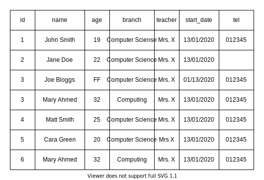

# Introduction to Data Cleansing

During writing, reading, storage, transmission, or processing, errors can occur which introduce unintended changes to the original data.

## Learning Objectives

By the end of this lesson, learners should be able to:

- Define what Data Cleansing is
- Explore areas to consider when assessing data quality
- Gain insight into the ways data is inspected
- Identify some approaches to cleansing data
- Apply basic cleaning techniques in Jupyter notebooks
  - Use Pandas to identify and fix simple data quality problems

## What is Data Cleansing?

Data cleansing is the process of detecting and correcting data quality.

Real-world data may be:

- Inaccurate
- Missing values
- Inconsistent
- Duplicated
- Poorly formatted
- Corrupt
- Irrelevant

There can also be Personally Identifiable Information (PII) in data that needs to be removed

Before analysing data, building dashboards, or training machine learning models, we usually need to clean the data first.

**Can you spot the dirty data?**

Reveal
Examples of dirty data in the image:

- Duplicate values in id column
- "FF" in age column
- Typo of "Computer Science" in branch column
- "Computing" vs "Computer Science" in branch column
- "Mrs X" vs "Mrs. X" in teacher column
- DD/MM/YYYY vs MM/DD/YYYY in start_date column
- Missing number in tel column
- Duplicate person "Mary Ahmed"

### Why Data Quality Matters

Poor quality data can lead to:

- Incorrect business decisions
- Misleading reports
- Failed automation
- Software bugs
- Unreliable machine learning predictions

A common phrase in data science is:

>“Garbage in, garbage out.”

If the input data is poor, the results will also be poor.

### Data Quality

When assessing data quality, consider the following:

- Validity
- Accuracy
- Consistency
- Completeness
- Uniformity

#### Validity

The degree to which the data conforms to defined business rules or constraints.

Examples could include:

- Ages should not be negative
- Email addresses should contain '@'
- Dates should use valid formats
- Product quantities should not be below zero
- Certain columns can't be empty
- Certain columns must be a particular data type.

#### Accuracy

The degree to which the data is 'true'.

For example, validating that a postcode actually exists, however, data can be valid, but inaccurate. If someone moves house but their data isn't updated, all of the address details are valid, but now inaccurate.

#### Consistency

The degree to which the data is consistent, within the same data set or across multiple data sets.

Examples include:

- A customer has two different addresses in two different tables.
  - This might indicate a need to normalise
- Different data being entered to represent the same thing; "uk", "UK", and "United Kingdom" all mean the same thing to a human, but not a computer.

Inconsistent data can cause:

- Incorrect grouping
- Duplicate categories
- Broken reports
- Poor visualisations

#### Completeness

The degree to which all the data required is known.

E.g. missing fields from a form that was filled in.

#### Uniformity

Ensuring that data is using the same format, unit, and structure.

Examples of non-uniform data:

|Price|
|---|
|£100|
|100 GBP|
|100|

or:

|Date|
|---|
|01/05/2026|
|2026-05-01|
|May 1st 2026|

Data that lacks uniformity may result in:

- Incorrect Sorting
- Calculations may break
- Data analysis becomes unreliable

### Summary Table

| Concept      | Meaning                               | Example Problem       |
| ------------ | ------------------------------------- | --------------------- |
| Validity     | Follows rules                         | Negative age          |
| Accuracy     | Reflects reality                      | Wrong salary          |
| Consistency  | Same meaning represented consistently | UK vs uk              |
| Completeness | Missing data exists                   | Empty email           |
| Uniformity   | Same formatting/style                 | Multiple date formats |

---

## Mitigating Against Bad Data

Cleansing is a crucial step in ensuring that we can extract value from our data, to inform:

- Data analysis
- Business intelligence
- Machine learning
- Software systems
- Reporting and dashboards
- Decision making

However, cleansing is just one step in a process of mitigating against bad data, to ensure all of the above areas and more are operating effectively, and contributing to business' outcomes.

1. Inspect
2. Cleanse
3. Verify
4. Report

### 1. Inspect

#### How to inspect data

- **Data profiling**: How many values are missing? How many unique values in a column, and their distribution?
- **Visualisations**: By analysing and visualising the data using statistical methods such as mean, standard deviation, range, or quantiles, one can find values that are unexpected.
- **Software packages**: Packages or libraries are available that let you specify constraints and check the data for violation of these constraints.

>Some common python packages like `Great Expectations`, or `dbt` let you define tests that check your data during processing.

### 2. Cleanse

The most important part of data cleansing!

The aim of cleansing data is to not only **cleanse** the data, but also bring **consistency** to the data.

#### How do we cleanse data?

There are some steps in cleansing data:

- Parse
- Correct
- Standardise
- Match
- Consolidate

#### Parse

Parsing data means we are breaking up the source data into smaller bits following some rules. This allows us to 'do things' with the data easily.

- E.g. splitting addresses so we can use only the postcode.

#### Correct

Now the data is in smaller chunks, we can now correct bits of it.

- E.g. fixing typos like "Hel.o" to "Hello".

#### Standardise

Now it's cleansed, we want to make sure the data is consistent and all looks the same.

- E.g. changing a date format from 04/29/2020 to 29/04/2020.

#### Match

Now we have cleansed and standardised data, we want to match it to our data definitions, and also rule out any duplicates.

- E.g. are there similar names and addresses, like Mr Andrew Smith and Mr A. Smith at the same address.

#### Consolidate

Now we find relationships between all of our data and merging them into one.

- E.g. The process of combining Mr Smith's data above into one correct record.

>In real-world projects, cleaning data often takes far more time than analysing it.

### 3. Verify

Now we've cleansed the data, we need to verify (inspect) it again to make sure we haven't made it worse!

- E.g. all dates are the correct format, duplicates have been removed, typos corrected etc.

### 4. Report

After we've verified the data, we want to take a look to understand what changes we made, and maybe consider why they occurred in the first place, and identify how we can avoid these issues happening again.

---

## Final Takeaways

Data cleansing is a process of:

- Inspecting
- Cleaning
- Verifying
- Reporting

...on your data.

Good quality data should be:

- Valid
- Accurate
- Consistent
- Complete
- Uniform

---

Implement data improvement steps using Pandas in your Jupyter environment by following [this tutorial](./data-cleansing-tutorial.md).
