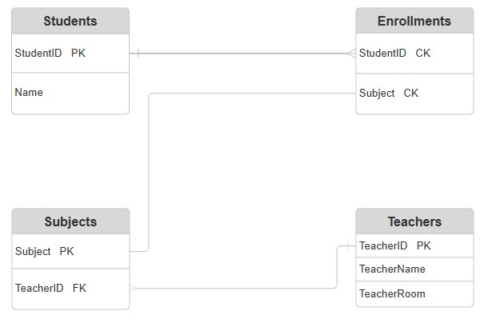

# Data Normalisation

## What is Data Normalisation?

Normalization means restructuring tables so each fact is stored once, eliminating redundancy and preventing update/insert/delete anomalies. It is applied in stages called normal forms (1NF → 2NF → 3NF), each removing a specific type of structural problem.

Normalization is the process of organizing relational data to reduce duplication and improve integrity. It breaks a large, messy table into smaller, well‑defined tables linked by keys. This prevents issues like inconsistent updates, wasted storage, and confusing queries.

The most commonly used normal forms are:

- **1NF**: No repeating groups, i.e. all values are atomic.
- **2NF**: No partial dependencies on part of a composite key.
- **3NF**: No transitive dependencies; non‑key columns depend only on the primary key.

Most production systems normalize to 3NF, which is usually sufficient.

### An Un-Normalised Data

Poor database design can cause integrity issues, we call these problems anomalies, and there are a few different types.

- Update anomaly - Occurs when updating a value requires updating it in several places throughout the DB
- Insertion anomaly - Occurs when data cannot be inserted, without additional unrelated data being also present
- Deletion anomaly - Occurs when removing an individual record also removes other data.

---

**College_records Table:**

|StudentID|Name|Subject|Teacher|TeacherRoom|
|---|---|---|---|---|
|101|Alice|"Math, Physics"|Mr. Smith|Room A1|
|102|Bob|Chemistry|Dr. Jones|Room B4|
|103|Charlie|Math|Mr. Smith|Room A1|
|104|Daisy|"Physics, Biology"|"Mr. Smith, Mrs. Green"|"Room A1, Room C2"|
|105|Evan|Chemistry|Dr. Jones|Room B4|

There are several anomalies with this table:

- **Update Anomaly**: If Mr. Smith is moving from Room A1 to Room A5 how many rows do we have to change? What happens if we miss one?
- **Insertion Anomaly**: We want to add a new Art class taught by Ms. Potter in Room D1, but no students have signed up yet, so we cannot add the record.
- **Deletion Anomaly**: If Bob (102) and Evan (105) both drop Chemistry then all info about the school's available courses could be lost forever.

We can resolve these issues by normalising our database design.

### First Normal Form (1NF)

The first normal form requires that all values must be atomic, i.e. no repeating groups or lists.

**College_records Table:**

|StudentID|Name|Subject|Teacher|TeacherRoom|
|---|---|---|---|---|
|101|Alice|"Math"|Mr. Smith|Room A1|
|101|Alice|"Physics"|Mr. Smith|Room A1|
|102|Bob|Chemistry|Dr. Jones|Room B4|
|103|Charlie|Math|Mr. Smith|Room A1|
|104|Daisy|"Biology"|"Mrs. Green"|"Room C2"|
|104|Daisy|"Physics"|"Mr. Smith"|"Room A1"|
|105|Evan|Chemistry|Dr. Jones|Room B4|

This is an improvement, querying for biology students, won't also return physics results, but there are still problems:

- Multiple fields have repeating values.
- We have inconsistent data entries (Math/"Math")
- `StudentID` + `Course` are acting as a `composite key` to uniquely identify a record, but non‑key attributes depend only on part of it.

>The `PRIMARY` key is a field which uniquely identifies a record in the table, a `COMPOSITE` key is when a combination of two or more fields are required to uniquely identify a record.

### Second Normal Form (2NF)

The second stage of normalisation (2NF) requires ensuring there are no **partial dependencies**, which is when a value in a record is only dependant upon *part* of a `composite key`.

In the last version all of the fields can repeat, therefore both `StudentID` and `Subject` are required to uniquely identify any record, forming a `composite key`.

However, `Teacher` and `TeacherRoom` are only defined by `Subject`, if they only depend upon one part of the composite key they have a **partial dependency**.

The same is true for `Name` which is only defined by `StudentID`, another partial dependency.

We solve this issue by splitting our data into separate tables.

**Students Table:**

|StudentID|Name|
|---|---|
|101|Alice|
|102|Bob|
|103|Charlie|
|104|Daisy|
|105|Evan|

>PRIMARY KEY = StudentID; No FOREIGN KEYS

**Enrollments Table:**

|StudentID|Subject|
|---|---|
|101|Math|
|101|Physics|
|102|Chemistry|
|103|Math|
|104|Physics|
|104|Biology|
|105|Chemistry|

>No unique field, so both `StudentID` and `Subject` form a composite key. However, these are both also FOREIGN KEYS; `StudentID` links to the PRIMARY KEY in the Students Table; `Subject` links to the PRIMARY KEY in the Subjects Table. This is known as a **Link or Junction Table**.

**Subjects Table:**

|Subject|Teacher|TeacherRoom|
|---|---|---|
|Math|Mr. Smith|Room A1|
|Physics|Mr. Smith|Room A1|
|Chemistry|Dr. Jones|Room B4|
|Biology|Mrs. Green|Room C2|

>PRIMARY KEY = Subject; No FOREIGN KEYS

There are now no partial dependencies, and we've reduced repetition, where values for `Name` & `Teacher` are now only stored once.

### Third Normal Form (3NF)

To meet the third normal form we need to remove **transitive dependencies** which is when non-key fields depend upon other non-key fields, rather than the primary or composite key.

Currently in the `Subjects` table, `TeacherRoom` is dependant upon the `Teacher` field, not the table's PRIMARY KEY `Subject`. As is, if Mr. Smith changed classrooms we would need to update two different records.

**Subjects Table:**

|Subject|TeacherID|
|---|---|
|Math|T_SMITH|
|Physics|T_SMITH|
|Biology|T_GREEN|

>PRIMARY KEY = Subject; TeacherID links to the PRIMARY KEY in the Teachers Table.

**Teachers Table:**

|TeacherID|TeacherName|TeacherRoom|
|---|---|---|
|T_SMITH|Mr. Smith|Room A1|
|T_JONES|Dr. Jones|Room B4|
|T_GREEN|Mrs. Green|Room C2|

>PRIMARY KEY = TeacherID; No FOREIGN KEYS

There are further normal forms, 4NF, 5NF & 6NF address advanced, complex scenarios involving multi-valued dependencies and join dependencies. There is also a stricter version of 3NF known as Boyce-Codd Normal Form (or 3.5NF). However, 3NF is sufficient for most production databases.

## The Final Layout

Our final database will have the following four tables:

**Students Table:**

|StudentID|Name|
|---|---|
|101|Alice|
|102|Bob|
|103|Charlie|
|104|Daisy|
|105|Evan|

**Enrollments Table:**

|StudentID|Subject|
|---|---|
|101|Math|
|101|Physics|
|102|Chemistry|
|103|Math|
|104|Physics|
|104|Biology|
|105|Chemistry|

**Subjects Table:**

|Subject|TeacherID|
|---|---|
|Math|T_SMITH|
|Physics|T_SMITH|
|Biology|T_GREEN|

**Teachers Table:**

|TeacherID|TeacherName|TeacherRoom|
|---|---|---|
|T_SMITH|Mr. Smith|Room A1|
|T_JONES|Dr. Jones|Room B4|
|T_GREEN|Mrs. Green|Room C2|

### Entity Relationship Diagrams (ERD)

ERDs are used to visualise the layout and relationships between the different tables in a database. Below is a simple example illustrating our database.



There are three types of entity relationship:

- **One to One**: One record in table A relates to only one record in table B; For example one enrollment on a course in the Enrollments Table, relates to only one course in the Courses Table.
- **One to Many**: One record in table A related to multiple records in Table B; For example one student can enroll in multiple courses.
- **Many to Many**: Multiple records in Table A relate to multiple records in Table B, this is usually implemented with a Link Table; For example, multiple students can enroll in multiple subjects, implemented through our Enrollments Table.

## Creating Our Database

Let's create the database we've been considering

### Create Tables

The following SELECT statements can be used to create our tables, however the order of creation is important, because when declaring a FOREIGN KEY, the table it points to must already exist.

We should create `Students` and `Teachers` first, then `Subjects`, and finally `Enrollments`.

```sql
-- Teachers Table
CREATE TABLE Teachers (
    TeacherID VARCHAR(10) PRIMARY KEY,
    TeacherName TEXT,
    TeacherRoom TEXT
);

-- Students Table
CREATE TABLE Students (
    StudentID INT PRIMARY KEY,
    Name TEXT
);

-- Subjects Table
CREATE TABLE Subjects (
    SubjectName VARCHAR(50) PRIMARY KEY,
    TeacherID VARCHAR(10),
    FOREIGN KEY (TeacherID) REFERENCES Teachers(TeacherID)
);

-- Enrollments Table
CREATE TABLE Enrollments (
    StudentID INT,
    SubjectName VARCHAR(50),
    PRIMARY KEY (StudentID, SubjectName),
    FOREIGN KEY (StudentID) REFERENCES Students(StudentID),
    FOREIGN KEY (SubjectName) REFERENCES Subjects(SubjectName)
);
```

### Inserting Data

We will insert the records in the same order we created the tables

```sql
-- Adding the Teachers
INSERT INTO Teachers (TeacherID, TeacherName, TeacherRoom) VALUES 
('T_SMITH', 'Mr. Smith', 'Room A1'),
('T_JONES', 'Dr. Jones', 'Room B4'),
('T_GREEN', 'Mrs. Green', 'Room C2');

-- Adding the Students
INSERT INTO Students (StudentID, Name) VALUES 
(101, 'Alice'),
(102, 'Bob'),
(103, 'Charlie'),
(104, 'Daisy'),
(105, 'Evan');

-- Adding the Subjects
INSERT INTO Subjects (SubjectName, TeacherID) VALUES 
('Math', 'T_SMITH'),
('Physics', 'T_SMITH'),
('Chemistry', 'T_JONES'),
('Biology', 'T_GREEN');

-- Adding the Enrollments
INSERT INTO Enrollments (StudentID, SubjectName) VALUES 
(101, 'Math'),
(101, 'Physics'),
(102, 'Chemistry'),
(103, 'Math'),
(104, 'Physics'),
(104, 'Biology'),
(105, 'Chemistry');
```

With the tables and data in place, you can start to ask questions of your database, or create different views of your data, using SELECT statements and joins.

Notice the `TableName.ColumnName` format used to reduce specify entities in the following examples:

- Show a list of students and the subjects they are enrolled in.

```sql
SELECT Students.Name, Enrollments.Subject
FROM Students
JOIN Enrollments ON Students.StudentID = Enrollments.StudentID;
```

- List every subject and the room where it is taught.

```sql
SELECT Subjects.Subject, Teachers.TeacherRoom
FROM Subjects
JOIN Teachers ON Subjects.TeacherID = Teachers.TeacherID;
```

Create a list showing Student Name, Subject, and Teacher Name.

```sql
SELECT Students.Name, Enrollments.Subject, Subjects.TeacherID
FROM Students
JOIN Enrollments ON Students.StudentID = Enrollments.StudentID
JOIN Subjects ON Enrollments.Subject = Subjects.Subject;
```

With these examples as a starting point, try to create some new queries yourself.

---

With this database we can illustrate the value of 3NF:

- Mr. Smith has been promoted and moved to a larger office in Room Z9.

How many rows do we need to update to ensure every student knows where to find him for Math AND Physics?"

```sql
UPDATE Teachers 
SET TeacherRoom = 'Room Z9' 
WHERE TeacherID = 'T_SMITH';
```

Even though five different students might be looking for Mr. Smith across two different subjects, we only need to change one single record in the database.

## Solo Normalisation Challenge

Normalise the following dataset by working though 1NF -> 3NF:

|OrderID|CustomerName|ItemsOrdered|TotalPrice|Barista|BaristaCertification|Station|
|---|---|---|---|---|---|---|
|5001|Jordan|"Latte, Muffin"|8.50|Sam|Senior|Espresso Bar|
|5002|Casey|Espresso|3.00|Alex|Trainee|Espresso Bar|
|5003|Jordan|"Tea, Cookie"|5.50|Sam|Senior|Brew Station|
|5004|Taylor|"Latte, Brownie, Water"|12.00|Sam|Senior|Espresso Bar|
|5005|Casey|Cappuccino|4.50|Riley|Intermediate|Espresso Bar|

If you're finding it challenging, [click here](./normalisation-challenge-tips.md) for some tips.


