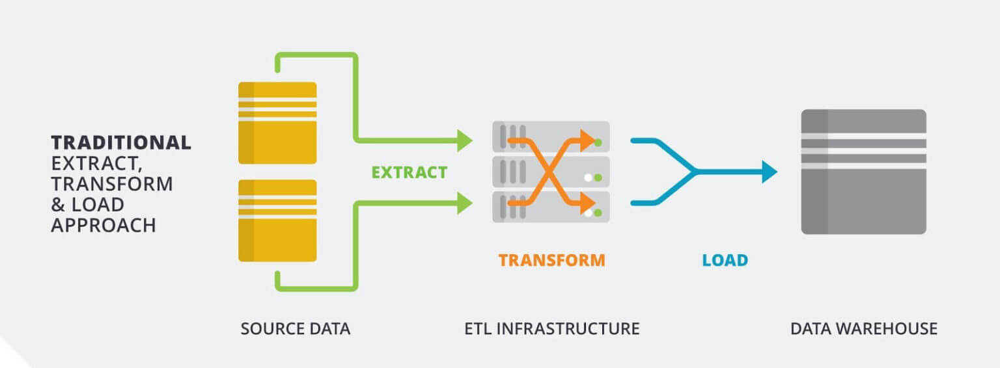

# Introduction to ETL

ETL (Extract, Transform, and Load) is essentially where raw data transforms into actual business value.

ETL facilitates us moving data from multiple sources and saving it in a single target location.

In brief the three stages are:

- **Extract**: Data is pulled from the relevant sources
- **Transform**: The data is changed to make it suitable for the target system
- **Load**: The transformed data is then saved into the target system

## Why ETL Processes are Required

There are many challenges which ETL processes can help overcome:

Often keeping track of data across many systems is complex when...

- Events occur at different times:
  - One source sends data by the minute, another aggregates data and sends it hourly

    Data from events may not arrive in the order that they happened and so will need reconciliation later
- Data formats and locations vary:
  - The logs from the backend come in CSV and the logs from the front end come in JSON but you want to make direct comparisons, only run the same query once etc.

    Companies store data in different places (Excel, SQL databases, CRM tools like Salesforce). ETL brings it all together.
- There's too much data to process when extracting:
  - This will only occur with big data (can be solved with out of the box solutions e.g. AWS Firehose)
- Systems are separated logically or physically:
  - You take data from the logs generated by your backend, which is hosted on AWS and you also take data from a third-party API. You want to bring the data from these sources into one place so they can back end queried together.
- Unpredictable extra load affects the source system:
  - If this happens, source system could become slow or inconsistent meaning the data you're extracting could have become stale or even faulty. Shows importance of monitoring and alerting in your ETL pipeline.
- Other problems:
  - APIs change over time, and not always with advanced warning.
  - Raw data is often "dirty" (missing values, inconsistent formatting). ETL cleans it.
  - Running complex analytical queries directly on your live production app database can slow it down for users. ETL can move that work to a dedicated system.

### Without ETL

Failing to address these challenges with our data in the real-world can result in significant consequences, including unreliable systems, and therefore unreliable data.

Examples include:

- **Financial transactions** - there need to be systems in place to warn if information is not up to date or if data has become corrupted. People's bank balances depend on this!
- **Scientific research** - might be less time sensitive but just as important that data is not lost and, if it is, there are alerts in place. A researcher's theories become harder to prove or disprove without this. Research often informs public policy on vital areas e.g. health, law, trade and education. Incorrect data could have a negative knock-on effect, creating policies informed by bad data.
- **Retail orders** - needs to accommodate rapidly changing usage patterns (e.g. online supermarkets after an announcement of lockdown) and keep track of people's orders - or at least be alerted if people's orders have got lost.

## Stages of ETL



### Extract

In this phase, you "read" the data from various sources. This could involve API calls, scraping web pages, server logs, third parties, or querying existing databases.

This data can come in a variety of formats:

- JSON
- XML
- CSV
- Parquet (a column-oriented data storage format)
- Databases
- Other formats such as log files

>Parquet files have greater compression than csv files. In some cases querying is faster that row based formats like csv due to the column-based structure. Processes can run down columns the same data type, rather than row-based where you're traversing different data types.

As a Data Engineer you will need to work with tools and systems that utilise these different data formats.

#### When Does Extraction Occur?

Extraction can be triggered by a variety of events, such as:

- A timed event occurs i.e. daily, hourly etc
- A database trigger event occurs
- A manual process is run
- A transaction (eg. banking apps which send a notification right after you've made a purchase)
- A news event (eg. automatic trading algorithms that process news feeds to decide whether to buy or sell)
- Natural environment changes, such as data from earthquake sensors, dam pressure sensors and the like breaching a particular threshold

#### How Does Extraction Occur?

You can extract the data using different transfer methods, for example:

- Secure File Transfer Protocol (SFTP) is a network protocol that provides file access, transfer and management.
- Network Shares are when a computer resource is made available from one host to other hosts on a network
- Object Stores like Amazon S3

#### How do you know the data is formatted correctly?

During extraction it is important to validate that the data is acceptable before passing to the transformation stage.

We can do this by matching predictable patterns, schemas or by running hash functions against the data.

If the data is invalid then appropriate alerting and/or metrics should be produced to inform customers and downstream systems.

### Transform

Rules or functions are applied to the extracted data to perform any of the following:

- Normalisation
  - Prepare data for inserting into a normalised database, typically to 3NF
- Cleaning the data to a specific format or encoding
  - Removing rows with null values in cells that you care about
- Selecting specific columns/fields
  - Time based exclusions, for tax reporting you only care about data between particular windows
- Performing calculations on fields
  - Find the average of a particular column, let's say average goals scored per season by a particular player over a season
- Standardizing
  - Converting all dates to YYYY-MM-DD or currencies to GBP.
- Filtering
  - Removing data you don't need (e.g., test accounts).
- Grouping or Aggregating
  - Summarizing raw transactions into daily totals.
- Sorting
  - Sort subscription information to have a visual rundown of where most subscribers live
- Deduplicating data
  - Removing duplicate records when multiple data sets are consolidated into one
- Joining data together with other datasets
  - Mapping relationship between flooding data sets and crop yield data sets

### Load

Finally, you load the data into the target storage solution, often another relational database system or a data warehouse. This can be a "Full Load" (everything every time) or an "Incremental Load" (only what changed since yesterday).

Often existing data is overwritten or updated with cumulative information on a daily, weekly, or monthly basis.

Complex systems can maintain a history and audit trail of all changes to the data loaded in the data warehouse.

### ETL vs. ELT

While ETL is the traditional method, ELT (Extract, Load, Transform) is becoming the modern standard thanks to powerful cloud warehouses like Snowflake or BigQuery.

### Advantages of ELT

- ELT can offer more flexibility in querying source data

  What happens if you want to run a different transformation (e.g. new SQL query) on your source data with an ETL pipeline? 
  
  You'd have to write the new query and then extract all of the source data again in order to perform the new transformation and get your insights. With a massive system this could be very expensive in both time and cost. In an ELT system you already have all your raw source data available, no need to extract it, so you just run the new query and get your results
- Easier to understand relationship between raw and transformed data

  ELT can make it easier for everyone to understand the relationship between the extracted and transformed data as it's all in once place. In an ETL pipeline the source data is in a different system, which reduces the ease of access and ability to compare with transformed data.
    - A business analyst wants to delve deeper into why they're getting a particular set of results. It's much easier for them to make comparisons between the raw source data with the transformed data when they're in the same place.
    - It's easier for a data engineer to get see how the data that flows through their pipeline is being used and potentially make improvements, fix bugs etc.
- Potential cost savings Savings

  Typically in an ELT pipeline the 'Load' location is in the cloud. This means that the computing power required for the transform stage can be scaled up and down according to a businesses needs. A business can just pay for what they need, when they need it, rather than having to invest in an on-premises fixed size system that they're not using to its full capacity most of the time

- Data protection - removing sensitive data before loading
  
  If an industry has tight regulations on what sensitive data can be stored where, it's likely an ETL pipeline is preferable as it's easier to guarantee that sensitive information from raw data can be scrubbed during the transform stage, before it's loaded into the target system
- Can save on storage costs - removing large unused files before loading

  If your source data contains large files (e.g. images) that you know you're never going to need, then it makes sense to not pay to store them in your target system - with ETL you can just ignore these files during the transform phase.

|Feature|ETL(Traditional)|ELT (Modern)|
|---|---|---|
|Sequence|Transform happens before loading.| Data is loaded before transforming.|
|Transformation Tool|Usually a separate engine (Python, Spark).|The Data Warehouse itself (using SQL).|
|Data Speed|Slower (bottleneck at transformation).|Much faster ingestion.|
|Raw Data Access|You only store the transformed data.|You store the raw data and the transformed version.|

### ETL Example

A real estate property company allows users to search for houses.

Each house can be accessed via their website using the path `/property-12345`.

Every time a page is accessed a record is stored in the property_view table against the property_id.

That table looks something like this (*assume there are many more rows*)...

```javascript
+-------------+---------------+---------+---------------+
| property_id |   timestamp   | browser |  ip_address   |
+-------------+---------------+---------+---------------+
|       12345 | 1580894343687 | Chrome  | 182.22.109.13 |
+-------------+---------------+---------+---------------+
```

Once per day the property page view counts for the previous day are extracted from the main application database, and inserted into a staging table (perhaps in a data warehouse).

The query looks something like this...

```sql
TRUNCATE TABLE warehouse_db.property_view_stage;

INSERT INTO warehouse_db.property_view_stage
SELECT * FROM main_db.property_view
WHERE timestamp >= 1580860800000
AND timestamp <= 1580947200000;
```

- `TRUNCATE`: A command used to quickly remove all records from a table while keeping the table's structure (columns, data types, and constraints) intact.
- `1580860800000`: This is a UNIX timestamp, which is an integer (BIGINT) which has been tracking milliseconds since 01-01-1970 (it's common to divide the timestamp by 1000 as seconds are often more relevant to a use case).

  Both SQL, Python, and many other systems are able to convert human-readable dates into UNIX timestamps and vice-versa. You can also use a site such as [unixtimestamp](https://www.unixtimestamp.com/) if you need a quick manual conversion.

The data is transformed using a `GROUP BY` aggregation and inserted into another staging table.

The query looks something like this...

```sql
TRUNCATE TABLE warehouse_db.page_view_daily_aggregation_stage;

INSERT INTO warehouse_db.page_view_daily_aggregation_stage
SELECT DATE(FROM_UNIXTIME(timestamp/1000)) as property_view_date,
property_id, COUNT(1) as property_view_count
FROM warehouse_db.property_view_stage
GROUP BY property_view_date, property_id;
```

This is the first complex line in the statement:

`DATE(FROM_UNIXTIME(timestamp/1000)) as property_view_date,
property_id, COUNT(1) as property_view_count`

Break it down a piece at a time:

- `DATE(FROM_UNIXTIME(timestamp/1000))`
  - `(timestamp/1000)`: divide the timestamp by 1000 to convert milliseconds to seconds.
  - `FROM_UNIXTIME` convert those seconds into a human readable datetime.
  - `DATE`: extracts just the date portion (year, month, day) from that datetime.
  - `as property_view_date`: the preceding transformation will be aliased in a new column called **property_view_date**.
  - `property_id`: SELECT the property_id as is
  - `COUNT(1) as property_view_count`: counts rows in each group (same as `COUNT(*)`), the output is aliased as **property_view_count** for the destination
- `FROM warehouse_db.property_view_stage`: Our staging table populated by the previous statement
- `GROUP BY property_view_date, property_id;` Groups records by both date and property; Each unique combination gets one row in the result

The output table will look like this...

```javascript
+--------------------+-------------+---------------------+
| property_view_date | property_id | property_view_count |
+--------------------+-------------+---------------------+
| 2020-02-05         |       12345 |                  32 |
| 2020-02-05         |       67890 |                  21 |
+--------------------+-------------+---------------------+
```

This data is then loaded to the final location where it can be used in reports by estate agents to their customers.

The query looks something like this...

```sql
INSERT INTO warehouse_db.page_view_daily_aggregation
SELECT * FROM warehouse_db.page_view_daily_aggregation_stage
```

The final aggregated data looking something like this...

```javascript
+--------------------+-------------+---------------------+
| property_view_date | property_id | property_view_count |
+--------------------+-------------+---------------------+
| 2020-02-05         |       12345 |                  32 |
| 2020-02-06         |       12345 |                  15 |
| 2020-02-05         |       67890 |                  32 |
| 2020-02-06         |       67890 |                  21 |
+--------------------+-------------+---------------------+
```

#### Summary

In this example:

1. The raw data was extracted from the initial table into a staging table, but only the records falling within specific dates
2. The data is transformed by:
   - Converting the unix timestamp into a human readable form
   - Counting records to provide an easily understandable summary
   - Grouping the data for analysis and decision making
3. The transformed data is loaded into the final table.

This data could be further aggregated or used to produce insightful customer reports.

As an example of insights and actions which may arise from the ETL process could be:

- **Property view rate**: If the amount of times your property is viewed is below the average, you could look at what keywords you're using to describe it and think about some search engine optimisation measures

- **Click through rate**: If this is below average you might want to think about things like what profile image you're using for the property, whether you would want to add more information like floor plans or simply increase the number of photographs

  A user could tweak these things one by one to see if their numbers start to change

- If all of a user's metrics are above average but the property still isn't selling, then they could start to think about what's not being recorded with the current system and whether that might provide some more insight into the behaviour they're seeing. For example:

  - There's no current way to record if visitors think the price is reasonable
  - There's no comparison of larger trends outside of page views:
    - Does the time of year impact on how many properties are sold vs. when people are more window-shopping? 
    - Is there a national slump in purchases that relates to wider economic conditions?

To greater understand this process you have a challene to work through here [INSERT LINK]

After attempting yourself, work through an example solution here INSERT LINK